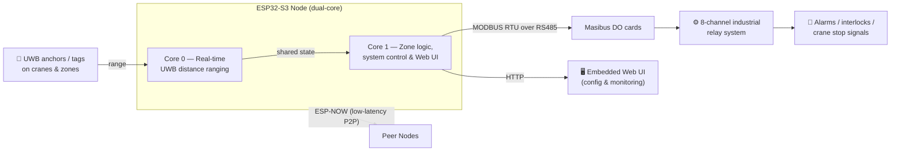

# 🏗️ Industrial Anti-Collision System

### Real-time UWB proximity safety for crane operations

<b>🏭 Deployed at Tata Steel BlueScope</b> &nbsp;·&nbsp; Built during my Embedded Systems Engineer internship at <b>Radiogeet</b>

---

> ℹ️ **About this repository** — This is a **case-study / showcase** of an industrial system I worked on **end to end** — hardware, firmware, testing, and on-site deployment. The production implementation is **proprietary to Radiogeet and its client**, so this repo documents the architecture, engineering decisions, and my contributions rather than hosting the source. Happy to walk through the technical details on request.

---

## 🎯 Overview

The **Anti-Collision System** prevents hazardous collisions during overhead **crane operations** in a heavy-industry steel plant. It continuously measures the distance between moving equipment using **Ultra-Wideband (UWB)** ranging, evaluates **zone-based safety logic** in real time, and drives **industrial outputs** (alarms, relays, interlocks) to slow or stop a crane before a collision can occur.

It runs today on the floor at **Tata Steel BlueScope**.

## 🧠 How It Works

### Dual-core design
The firmware leverages the **ESP32-S3's dual-core architecture** to keep safety-critical timing isolated from everything else:

| Core | Responsibility |
|------|----------------|
| **Core 0** | Time-critical **UWB distance measurement** — deterministic ranging loop, kept free of blocking work |
| **Core 1** | **Zone calculation & safety logic**, system control, and the **embedded web interface** for configuration/monitoring |

## ⚙️ Key Engineering

- 📏 **UWB proximity detection** — real-time distance ranging between cranes and defined safety zones.
- 🧮 **Zone-based safety logic** — configurable warning/danger zones that escalate from alert → interlock → stop.
- 📡 **ESP-NOW** — low-latency, peer-to-peer wireless links between distributed system nodes (no AP dependency).
- 🔌 **MODBUS RTU over RS485** — robust industrial fieldbus to **Masibus DO cards**, driving an **8-channel relay system**.
- 🖥️ **Embedded web interface** — on-device configuration and live monitoring served straight from the ESP32-S3.
- ⏱️ **Deterministic firmware** — careful task partitioning so ranging never starves on logic or networking.

## 🧰 Tech Stack

| Area | Technologies |
|------|--------------|
| **MCU** | ESP32-S3 (dual-core), ESP-IDF |
| **Ranging** | Ultra-Wideband (UWB) |
| **Wireless** | ESP-NOW |
| **Fieldbus** | MODBUS RTU over RS485, Masibus DO cards |
| **Outputs** | 8-channel industrial relay system |
| **Interface** | Embedded HTTP web UI |
| **Language** | Embedded C / C++ |

## 👤 My Role — End-to-End Ownership

I worked on this project **end to end across the entire stack** as the **Embedded Systems Engineer** at **Radiogeet** — from picking the hardware to commissioning it on the factory floor:

**🔩 Hardware**
- **Selected the hardware** and components for the whole system.
- **Wired and integrated the Masibus DO cards** and the **8-channel industrial relay system**.
- Built out the **RS485 physical layer** and node interconnects.

**💻 Firmware**
- Designed and implemented the **complete ESP32-S3 firmware**, leveraging the dual-core architecture.
- **Core 0** → time-critical **UWB ranging**; **Core 1** → zone safety logic, system control, and the embedded **web UI**.
- Implemented **ESP-NOW** for low-latency node-to-node communication.
- **Established MODBUS RTU over RS485** communication with the Masibus DO cards to drive the 8-channel relay system.

**🧪 Testing & Deployment**
- **Tested and validated** the full system end to end.
- **Deployed and commissioned it on-site in production at Tata Steel BlueScope**.

---

### 📬 Get in touch

Part of <a href="https://github.com/ramuroy">@ramuroy</a>'s embedded systems portfolio · firmware that ships to the factory floor.

